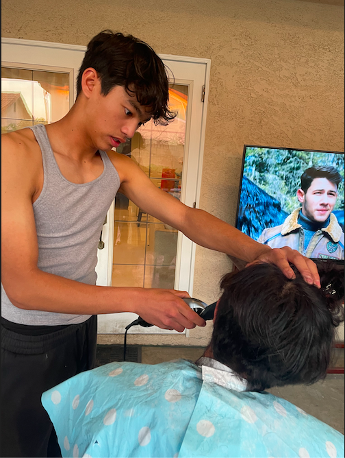
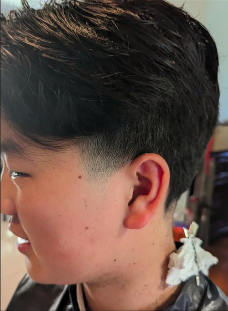
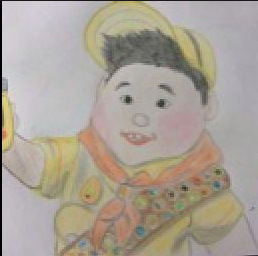

# avcutshair
"my name is aaron and I cut hair"
<html>
<head>
</head>
<body> 
  <h1> About </h1>
<h2> My name is Aaron and I cut hair. I've been cutting for 9 months now and I've cut over 30 people so I'm kind of experienced. I cut all hair types and do plenty of hairstyles. </h2>

<h3> Why I started </h3>
<h4>My mom used to cut my hair so we would have haircut tools at my house. One day, my friend Benjamin had terrible hair and with no experienced I offered to cut his hair. With no experience, I just did it over 1 hour and 40 min for my first time on the first day of Winter Break. That day started it all. </h4>

<h3> Services </h3>
<h4> $5 Haircuts </h4> 
&#128558 

<ul>
  <li> Tapers </li>
  <li> Scissor Cuts </li>
  <li> Bald </li>
  <li> Buzz Cut </li>
  <li >Lebron James </li>
  <li> Shiny Bald </li> 
  <li> Mohalk </li> 
  <li> Reverse Mohawk </li>
  <li>Inverted Mohawk </li>
</ul>

<a href="(https://www.wikihow.com/Cut-Your-Own-Hair-(Men)"> How I learned to cut hair</a>
 
 

First Haircut in my Backyard 12/22

 Haircut I did on TJ

 
 
 

</body>

</html>
