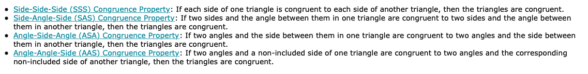

# avcutshair
"my name is aaron and I cut hair"
!DOCTYPE html>
<html>
<head>
</head>
<body> 

 Mr. <strong>Marchant </strong> 

 Mr. Marchant is 

 Mr. Marchant is cool 

<h6> Remember me though I have to say goodbye
Remember me, don't let it make you cry
For even if I'm far away, I hold you in my heart
I sing a secret song to you each night we are apart
Remember me though I have to travel far
Remember me each time you hear a sad guitar
Know that I'm with you the only way that I can be
Until you're in my arms again
Remember me </h6>

 Mr. Ou is my favorite teacher tho 

</body>

</html>
